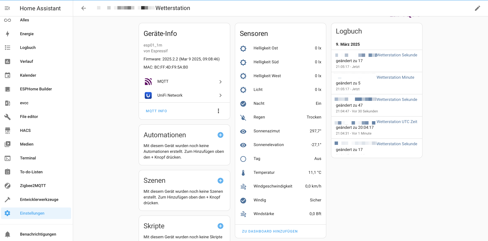
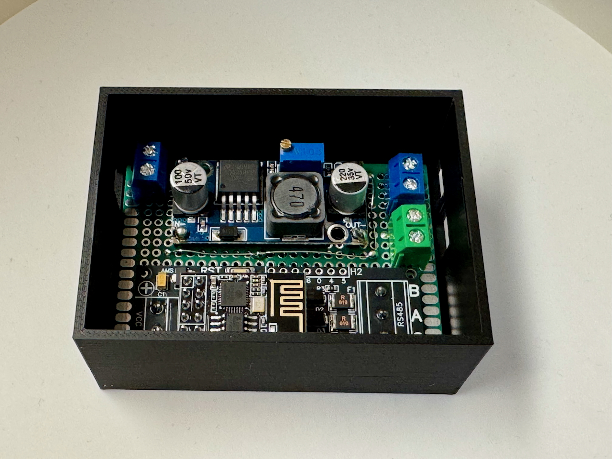

### English Version

# ESPHome Modbus Converter Project - Elsner Elektronik Weather Station (P03/3) Integration with Home Assistant

This project implements a weather station using ESPHome, which communicates with an Elsner Elektronik weather sensor (P03/3) via Modbus and integrates the data into Home Assistant.



## Overview

The weather station captures the following weather data:
- Temperature
- Brightness (South, West, East)
- Light
- Wind speed
- Rain
- Sun position (Azimuth and Elevation)
- GPS coordinates (if GPS variant)
- Date and time UTC (if GPS variant)

## Hardware

- ESP8266 (ESP-01 with 1MB Flash)
- Elsner Elektronik P03/3 weather station
- EI-OT Tasmota RS485 ESP-01 WLAN WiFi Bridge module
- LM2596 DC-DC Step-Down voltage regulator (2-3A)

## Electrical Circuit

The electrical supply of the system is realized as follows:

1. A 24V power supply serves as the primary power source.
2. The LM2596 step-down converter converts 24V to 12V to power the ESP-01.
3. The 24V voltage is passed through in parallel to the output.

The LM2596 voltage regulator can handle input voltages from 4.5V to 40V and provides a stable output voltage with up to 3A (1.5A continuous). The efficiency is up to 92%, ensuring minimal heat generation.

The EI-OT RS485 WiFi bridge module supports input voltages from 5-12V via the VIN screw terminal. It is based on the SP3485EN combined with the 74HC04D to convert the RS485 signal to the UART interface of the ESP-01+.

### Simplified Circuit Diagram

```
+----------+     +------------+     +---------+
|          |     |            |     |         |
| 24V      +-----+ LM2596     +-----+ ESP-01  |
| Power    |     | Step-Down  |     | RS485   |
| Supply   |     | (12V Out)  |     | Module  |
+----------+     +------------+     +---------+
      |                                  |
      |                                  |
      v                                  v
+----------+                       +---------+
|          |                       |         |
| 24V      |                       | RS485   |
| Output   |                       | Output  |
|          |                       |         |
+----------+                       +---------+
```




## Elsner Elektronik P03/3 Weather Station

The P03/3 is a weather station from Elsner Elektronik with the following features:
- Brightness measurement with three separate sensors for East, South, and West
- Electronic wind measurement (0-35 m/s)
- Temperature measurement (-40°C to +80°C)
- Heated precipitation sensor
- Integrated GPS receiver
- Operating voltage: 24V DC
- Protection class: IP 44
- Dimensions: approximately 96 × 77 × 118 mm (W × H × D)

For more information: [Elsner Elektronik P03/3](https://www.elsner-elektronik.de/de/p03-3-modbus.html)

## Features

### Weather Data
- **Temperature**: Capture ambient temperature in °C
- **Brightness**: Measurement in three directions (South, West, East) in Lux
- **Light**: General light measurement in Lux
- **Wind**: Capture wind speed in m/s and calculate the Beaufort scale
- **Rain**: Binary sensor for rain detection
- **Sun Position**: Calculate azimuth and elevation of the sun

### Additional Features
- Day/Night detection based on sun elevation
- Calculation of maximum brightness from all directions
- GPS/RTC status display
- Date and time display (UTC)

### Diagnostics
- WiFi signal strength and quality
- WiFi channel and connection information
- Uptime tracking
- Restart button for the ESP

## Installation

1. Install ESPHome on your system
2. Copy the [YAML configuration](weatherstation.yaml) into a new file
3. Create a `secrets.yaml` file with WiFi and MQTT access data
4. Compile and flash the firmware onto your ESP

## Modbus Configuration

The weather station communicates with the sensor via Modbus with the following parameters:
- Baudrate: 19200
- Data bits: 8
- Stop bits: 1
- Parity: EVEN
- Modbus address: 0x01
- Flow control pin: GPIO2
- TX pin: GPIO1
- RX pin: GPIO3

## Home Assistant Integration

The weather station is automatically integrated into Home Assistant via MQTT Discovery. All sensors are configured with appropriate device classes and measurement units.

## 3D Printed Enclosure

This project provides suitable 3D print files for an enclosure that allows weather-resistant and aesthetically pleasing mounting of the electronic components.


## 3D Printed Mounting on a Window Sill

This project provides suitable 3D print files for an enclosure that allows weather-resistant and aesthetically pleasing mounting without drilling into the exterior facade.


## Customization

You can adjust the configuration to suit your needs:
- Change update intervals for more frequent or less frequent updates
- Adjust Modbus parameters if you use a different sensor
- Add more calculated sensors to obtain additional weather data

## Use for Other Modbus Projects

This implementation can serve as a basis for other Modbus-based projects. The Modbus controller configuration is flexible and can be easily adapted to other Modbus devices. The structure of the sensors and data processing provides a solid foundation for similar projects.

## Troubleshooting

For communication issues with the Modbus sensor:
1. Increase the log level to `VERY_VERBOSE` for detailed Modbus logs
2. Check the wiring and Modbus parameters
3. Ensure the flow control pin is correctly configured


### Deutsche Version

# ESPHome Modbus-Konverter-Projekt - Elsner Elektronik Wetterstation (P03/3) Integration in Home Assistant

Dieses Projekt implementiert eine Wetterstation mit ESPHome, die über Modbus mit einem Wettersensor von Elsner Elektronik (P03/3) kommuniziert und die Daten in Home Assistant integriert.


## Überblick

Die Wetterstation erfasst folgende Wetterdaten:
- Temperatur
- Helligkeit (Süd, West, Ost)
- Licht
- Windgeschwindigkeit
- Regen
- Sonnenposition (Azimut und Elevation)
- GPS-Koordinaten (wenn GPS-Variante)
- Datum und Uhrzeit UTC (wenn GPS-Variante)

## Hardware

- ESP8266 (ESP-01 mit 1MB Flash)
- Elsner Elektronik P03/3 Wetterstation
- EI-OT Tasmota RS485 ESP-01 WLAN WiFi Bridge Modul
- LM2596 DC-DC Step-Down Spannungsregler (2-3A)

## Elektrische Schaltung

Die elektrische Versorgung des Systems wird wie folgt realisiert:

1. Ein 24V Netzteil dient als primäre Stromquelle.
2. Der LM2596 Step-Down Converter wandelt die 24V in 12V um, um den ESP-01 zu versorgen.
3. Parallel wird die 24V Spannung direkt zum Ausgang durchgeschleift.

Der LM2596 Spannungsregler kann Eingangsspannungen von 4,5V bis 40V verarbeiten und liefert eine stabile Ausgangsspannung mit bis zu 3A (1,5A kontinuierlich). Die Effizienz liegt bei bis zu 92%, was für eine geringe Wärmeentwicklung sorgt.

Das EI-OT RS485 WiFi Bridge Modul unterstützt Eingangsspannungen von 5-12V über die VIN Schraubklemme. Es basiert auf dem SP3485EN in Kombination mit dem 74HC04D zur Umsetzung des RS485-Signals auf die UART-Schnittstelle des ESP-01+.

### Vereinfachter Schaltplan

```
+----------+     +------------+     +---------+
|          |     |            |     |         |
| 24V      +-----+ LM2596     +-----+ ESP-01  |
| Netzteil |     | Step-Down  |     | RS485   |
|          |     | (12V Out)  |     | Modul   |
+----------+     +------------+     +---------+
      |                                  |
      |                                  |
      v                                  v
+----------+                       +---------+
|          |                       |         |
| 24V      |                       | RS485   |
| Ausgang  |                       | Ausgang |
|          |                       |         |
+----------+                       +---------+
```


## Wetterstation Elsner Elektronik P03/3

Die P03/3 ist eine Wetterstation von Elsner Elektronik mit folgenden Eigenschaften:
- Helligkeitsmessung mit drei separaten Sensoren für Ost, Süd und West
- Elektronische Windmessung (0-35 m/s)
- Temperaturmessung (-40°C bis +80°C)
- Beheizter Niederschlagssensor
- Integrierter GPS-Empfänger
- Betriebsspannung: 24V DC
- Schutzgrad: IP 44
- Maße: ca. 96 × 77 × 118 mm (B × H × T)

Weitere Informationen: [Elsner Elektronik P03/3](https://www.elsner-elektronik.de/de/p03-3-modbus.html)

## Funktionen

### Wetterdaten
- **Temperatur**: Erfassung der Umgebungstemperatur in °C
- **Helligkeit**: Messung in drei Richtungen (Süd, West, Ost) in Lux
- **Licht**: Allgemeine Lichtmessung in Lux
- **Wind**: Erfassung der Windgeschwindigkeit in m/s und Berechnung der Beaufort-Skala
- **Regen**: Binärer Sensor zur Regenerkennung
- **Sonnenposition**: Berechnung von Azimut und Elevation der Sonne

### Zusätzliche Funktionen
- Tag/Nacht-Erkennung basierend auf Sonnenelevation
- Berechnung der maximalen Helligkeit aus allen Richtungen
- GPS/RTC-Statusanzeige
- Datum- und Zeitanzeige (UTC)

### Diagnose
- WLAN-Signalstärke und -qualität
- WLAN-Kanal und Verbindungsinformationen
- Uptime-Tracking
- Neustart-Button für den ESP

## Installation

1. Installiere ESPHome auf deinem System
2. Kopiere die [YAML-Konfiguration](weatherstation.yaml) in eine neue Datei
3. Erstelle eine `secrets.yaml` Datei mit den WLAN- und MQTT-Zugangsdaten
4. Kompiliere und flashe die Firmware auf deinen ESP

## Modbus-Konfiguration

Die Wetterstation kommuniziert über Modbus mit dem Sensor mit folgenden Parametern:
- Baudrate: 19200
- Datenbits: 8
- Stoppbits: 1
- Parität: EVEN
- Modbus-Adresse: 0x01
- Flow Control Pin: GPIO2
- TX Pin: GPIO1
- RX Pin: GPIO3

## Home Assistant Integration

Die Wetterstation wird automatisch in Home Assistant über MQTT Discovery integriert. Alle Sensoren werden mit passenden Geräteklassen und Messeinheiten konfiguriert.

## 3D-Druck Gehäuse

Für dieses Projekt werden passende 3D-Druckdateien für ein Gehäuse zur Verfügung gestellt. Diese ermöglichen eine wetterfeste und ästhetische Montage der Elektronikkomponenten.


## 3D-Druck Befestigung an einem Fenstersims

Für dieses Projekt werden passende 3D-Druckdateien für ein Gehäuse zur Verfügung gestellt. Diese ermöglichen eine wetterfeste und ästhetische Montage ohne zu bohren an der Außenfassade.


## Anpassung

Du kannst die Konfiguration an deine Bedürfnisse anpassen:
- Ändere die Update-Intervalle für häufigere oder seltenere Aktualisierungen
- Passe die Modbus-Parameter an, wenn du einen anderen Sensor verwendest
- Füge weitere berechnete Sensoren hinzu, um zusätzliche Wetterdaten zu erhalten

## Verwendung für andere Modbus-Projekte

Diese Implementierung kann als Grundlage für andere Modbus-basierte Projekte dienen. Die Modbus-Controller-Konfiguration ist flexibel und kann leicht an andere Modbus-Geräte angepasst werden. Die Struktur der Sensoren und die Verarbeitung der Daten bieten ein solides Fundament für ähnliche Projekte.

## Fehlerbehebung

Bei Kommunikationsproblemen mit dem Modbus-Sensor:
1. Erhöhe das Log-Level auf `VERY_VERBOSE` für detaillierte Modbus-Logs
2. Überprüfe die Verkabelung und die Modbus-Parameter
3. Stelle sicher, dass der Flow-Control-Pin korrekt konfiguriert ist

